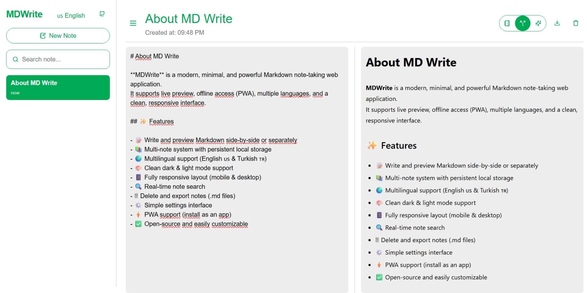
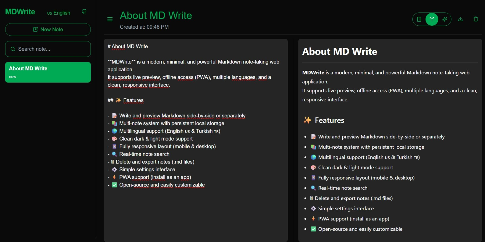

<p align="center">
    
    <h1 align="center">MDWrite</h1>
</p>

[](https://nextjs.org/)
[](https://nextjs.org/)
[](https://nextjs.org/)
[](https://nextjs.org/)
[]()

**MDWrite** is a modern, minimal, and powerful Markdown note-taking web application.  
It supports live preview, offline access (PWA), multiple languages, and a clean, responsive interface.

## ✨ Features

- 📝 Write and preview Markdown side-by-side or separately
- 📚 Multi-note system with persistent local storage
- 🌍 Multilingual support (English 🇺🇸 & Turkish 🇹🇷)
- 🎨 Clean dark & light mode support
- 📱 Fully responsive layout (mobile & desktop)
- 🔍 Real-time note search
- 🗑 Delete and export notes (.md files)
- ⚙️ Simple settings interface
- ⚡ PWA support (install as an app)
- ✅ Open-source and easily customizable

---

## 🖼️ Screenshots

| Light Theme | Dark Theme |
|-------------|------------|
|  |  |

---

## 🚀 Getting Started

### 1. Clone the repository

```bash
git clone https://github.com/nazimcanislam/md-write.git
cd mdwrite
```

### 2. Install dependencies

```bash
npm install
```

### 3. Start development server

```bash
npm run dev
```

### 4. Build for production

```bash
npm run build
npm start
```

## Built With
- Next.js
- Tailwind CSS
- React Markdown
- Lucide React Icons
- TypeScript
- PWA support

## 📁 Project Structure

```text
src/app
    /components      → Reusable components (e.g., Button)
    /context         → Language context
    /markdown        → Editor and preview
/public
  /images          → Favicon and icons
/styles
  globals.css      → Theme + custom styles
```

## 🛡 License

MIT © **Nazımcan İslam**

> You can personalize the GitHub URL and screenshot paths as needed.
